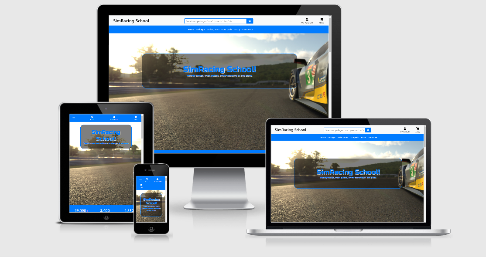

# SimDriver School
Milestone project 4: Full Stack Frameworks with Django.

This project is an e-commerce shop selling digital content which is providing help to sim racers with weekly setups and videos to improove their laptimes and consistency with the sim title iRacing.com. 

### For testing the Stripe checkout use the following:
 - __Card number__: 4242 4242 4242 4242
 - __CVC__: any 3 digits
 - __Card expiry date__: any future date
 - __ZIP/Postcode__: any 5 digits

Link to the live site on Heroku: [here](https://ci-ms4-simracing-school.herokuapp.com/)

## User Experience (UX)

- ### User Stories
    - #### First Time Visitors Goals
        1. Want to easily understand the main purpose of the site.
        2. Want to be able to easily navigate throughout the site to find content.
        3. Want to easily find social media links, so I can gather more information about the site and site owner
        4. To view a list of products so I can select some to purchase.
        5. View individual products details so I can identify the price, description, time duration if applicable
    - #### Returning Visitors Goals
        1. Want to view the total of my purchases so I can manage to don't spend too much.
        2. Easy registration process
        3. Easily login or logout to access my personal account information
        4. Receive an email confirmation after registering, so I can verify that my account registration was successful.
        5. Have a user profile, to check my personal order history, to view my active data pack and the expiry date of my active data pack, and save my payment information.
        6. Sort a specific category of product to easily find the right product for my needs.
    - #### Frequent User Goals
        1. Receive a notification when my active data pack is expired.
        2. If I have any questions I would be able to find the right answer or able to contact the site owner.
        3. I want to get the best deals if it's possible when I'm purchasing data packs.
        4. Want to be able to download my purchased data before the specific week starts in iRacing to have enough time to practice.
    - #### Site Owner Goals
        1. Want to view and adjust customer orders.
        2. Easily update the setup data packs.

- ### Design
    - Colour Scheme
        - The main 3 white, lightgrey (rgba(211, 211, 211, .5)), and blue (#007bff) colours was used through the site. For the footer used an "asphalt" style background with white fonts.
    - Typography
        - The default font was not changed except the landing page hero logo Russo One was used for that. 

- ### Wireframes
    - Landing page [view]
    - Packages page [view]
    - Series/Cars page [view]
    - Datapacks page [view]
    - F.A.Q. page [view]
    - Contact Us page [view]
---
## Features
- Responsive design on all device screen sizes
- Interactive background on the landing page created with JavaScript

### Existing Features
- ### Landing Page
    - When the site will be loaded the users should find themselves on the landing page, where they can see the brand logo in the middle and an interactive background which is changing periodically. After scrolling down they can view some achievements reached by us. Further down can be found the detailed information of our two packages (silver, gold) and what is the difference between them. By scrolling further down they can find advertisement links from our partners and why they should choose our service. At the bottom of the page, there is a footer with some quick links, info and social media links.
- ### Navigation Bar
    - #### Top Navigation Bar
        - On the left is a brand logo with a link to the landing page which is visible only on large screens
        - On the middle is a search bar to browse between products. On smaller screens, the bar collapse into a search icon
        - On the right is the user and the cart icons to manage user profile and shopping.
    - #### Navigation bar
        - __*Home*__ - Link to the landing page
        - __*Packages*__ - Choose between two packages Silver (a single setup package) or Gold (all packages are avaiable).
        - __*Series/Cars*__ - A list of series and cars which we are providing setups for. 
        - __*Data Packs*__ - Users are able to download setup data packs from here after they purchased it.  
        - __*F.A.Q.*__ - By clicking this link users can see the most frequent questions and the answers.
        - __*Contact Us*__ - By clicking the contact us link the contact form will be displayed where users are able to send messages to the site owner(s).
- ### Packages page
    - Users can see our two packages with detailed info about what is included in these packages. Price, duration etc. They are able to add the Gold package to the cart from this page and choose the selected car for the Silver package.
- ### Series/Cars page
    - This page is displaying the available series and cars for the Silver Package. The user can choose the selected package from here and add to the cart. On the top, there is a dropdown menu to select the specific series only which will display only the cars are available in that specific series. 
    - By clicking on the __*Details*__ button a new page will be open with detailed info about that car, data pack. Click on the __*Add to cart*__ button they can add the selected product to the cart.
    - If the users try to add more than one single data pack to the cart they will receive a short info message that they should upgrade to the Gold Package for the same price and they will be able to access all of the setup data packs for all cars. They can do it with a simple click on the __*Upgrade to Gold Package*__ button.
    - Site admins will see two buttons to __*Edit/Update*__ or __*Delete*__ that specific product from the database.
- ### Datapacks page
    - These pages are required to be logged in if the user is not logged in they will ask to login
    - __*Datapack select page*__ - First, the users will be able to see on the left side a list from the series. By clicking on one of the series buttons, the available cars will be displayed on the right side of the screen. To the actual setup data, they need to click on the __*Datapacks*__ button on the selected car's row.
    - __*Datapacks page*__ 
        - First, the page will check if the user has any data pack purchased, if not they will be informed that there is no active data pack found in the database and they need to purchase one to reach these page content. 
        - If a user has a single (Silver Package) data pack the page will check which data pack has the user purchased and will give access to only that one data pack. If they try to access some different data pack the page will inform the user if they want to access that specific pack they need to upgrade to Gold Package with a button to do the upgrade. 
        - If a user has access to the specific data pack or all of them they are able to see an extra navigation bar with a link to every 12 weeks and go back to the data pack select page. For each week they can find the week number, the car info and the track name in the top, followed by the hot lap video on the left (which is just a dummy video now just to see how it's would look like in real production) and the setup files on the right. There are five different files for each week/car combo. The files are: race setup, qualifying setup, telemetry data file, .blap file (best lap) and .olap file (optimal lap). The file names containing the series, week, car, "r" for race and "q" for quali setup details. e.q.(*imsa-w1-bmw-m8-gte-r.sto*) for clarity that the user knows which file is for which car and week.
        - __*Admins*__ - Can find options to edit/update or delete the datapacks week by week.
- ### F.A.Q. page
    - Users are able to find answers to some frequently asked questions. There are three groups of questions like: General, Payment, Packages. They need to click on the question and the answer will slide down and the background of the active question will turn blue to highlight it.
- ### Contact Us page
    - Users will see a form to contact the site owner. They need to fill out the form with the required informations like email, subject and the message and click the __*Send Message*__ button. If the form is valid the user will notice a small message window on the top left corner that the message was sent successfully. If there was some error it will be displayed at the same place.
- ### Profile page
    - Users are able to find information about their profile like:
        - The default account info on the left. Which are phone number, address of the user to easier checkout. If this informations are saved the page will prefill the checkout form for the user.
        - On the right are two sections, My Package and Order History.
            - __My package__: Displays if the user has any currently active package and the date when the package will expire. If they have a single setup data pack there will be a button displayed to upgrade to gold package or if the user don't have any active data pack the button will take the users to the products(cars) list page to choose one.
            - __Order history__: Users are able to see all past orders what they purchased. By clicking on the order number they can see the detailed order info with the products, date, email, phone number and address. The button under the displayed info will take the user back to the profile page.
    - Admins have two extra options on their profile menu which are __*Product Management*__ and __*Datapack Management*__. Whit these options they can add new product and data pack to the database.
- ### Shopping Cart page
    - If the user added anything to the cart they can see the product name, quantity, price, and total price here. They can remove the items from the cart with clicking on the red trashbin icon. Under the total price they can find two buttons to keep shopping or go to secure checkout. If they don't have any item in the cart the page will display a message that the cart is empty and a button to the products page.
- ### Checkout page
    - This page has two sections on the right a detailed order summary and on the left a checkout form that takes the user's details (name, email, phone, address) and a payment section provided by Stripe that takes teh card number, expiry date, CVC and ZIP/Postcode. Stripe payment is in test mode so no payments are taken from the users. By clicking on the __*Complete Order*__ button the payment will be processed and the details given checked. If everything was valid the payment will made. The user will be redirected to the __Checkout Success__ page.
- ### Checkout Success page
    - The user will be able to view a summary from his/her order. Containing every information about the purchase (order number, date, product(s), billing info, email). On the top right corned a message will be displayed that the confirmation email sent to the user's email address. Under the order summary there is a button __*Now check out your new datapack(s)*__ with a link to the datapacks.
- ### Footer
    Footer has three main sections:
    - __*Left*__: There are some quick links (packages, FAQs and Contact Us)
    - __*Middle*__: Contains information from the site, the creation date and from who created it.
    - __*Right*__: Social media links. 
### Future Features
- ### Driver coaching 
    - The users will be able to book appointments for the 1:1 coaching sessions.
- ### Setups for the big events
    - Planning to provide setups for the big events of iRacing like (24h LeMans, 24h Spa, etc.)
---
## Technologies Used
### Programming Languages Used
* HTML
* CSS
* JavaScript
* Python
* [Jinja](https://jinja.palletsprojects.com/en/2.11.x/) template language
### Programs, Frameworks and Libraries Used
* [Django Framework (Python)](https://www.djangoproject.com/)
* [Google Fonts](https://fonts.google.com/)
* [Bootstrap 4](https://getbootstrap.com/)
* [Font Awesome](https://fontawesome.com/)
* [GitHub Desktop](https://desktop.github.com/)
* [Visual Studio Code](https://code.visualstudio.com/)
* [Stripe payments](https://stripe.com/gb)
* [Heroku](https://heroku.com)
* [AWS S3](http://aws.amazon.com/)
* [GIMP - GNU Image Manipulation Program](https://www.gimp.org/)
### Databases
* Sqlite3 in development
* PostgreSQL in production (by Heroku)
---

## Testing
### Responsiveness 
The site was tested with multiple browsers(Opera, Firefox, Chrome, MS Edge) and devices(desktop PC, iPad mini, iPhone SE 2020 and iPhone 6), and with all the options from Chrome Development tools. The pictures and the design were responsive and displayed as they should be. I asked few friends and family members to test the site on their device.

### Code Validation
* Validated the HTML code with [W3C](https://validator.w3.org/#validate_by_input) and no error found.
* Validated the CSS code with [W3C](https://jigsaw.w3.org/css-validator/#validate_by_input) and no error found.
* Validated the Python code with [PEP8online](http://pep8online.com/) and no error found.
* Validated the JavaScript code with [JSHint](https://jshint.com/) and no error found. 

### Testing User Stories from User Experience (UX) Section
- #### First Time Visitor Goals
    - Want to easily understand the main purpose of the site
        1. On the landing page is a big logo displayed in the middle of the screen with a site name and purpose
        2. Further, down on the landing page, they can find more detailed info about the site and what services are offered to the users 
    - Want to be able to easily navigate throughout the site to find content
        1. The navigation bar is always visible on the top of the page with all the links which can take the user directly to that section which is needed
        2. The search bar can be used to find the product which the user is looking for
    - Want to easily find social media links, so I can gather more information about the site and site owner
        1. The footer is visible all the time on the bottom of the site with the social media links.
        2. When the user using these social media links they will open in a new tab, so they will not loose where they were on the site
    - To view a list of products so I can select some to purchase
        1. Under the Packages menu in the navigation bar users can find what packages the site is offering.
        2. If the user choose to buy a single setup package (Silver Package) then they are able to choose between 29 cars under the Series/Cars section. 
    - View individual products details so I can identify the price, description, time duration if applicable
        1. By clicking on the __*Details*__ button on the selected product/car a new site will be opened with the detailed information of the product/car like name, series name, price, time duration. 
- #### Returning Visitor Goals
    - Want to view the total of my purchases so I can manage to don't spend too much.
        1. In the top right of the site they can see the cart icon
        2. Anytime something is added to the cart that will be displayed with a success message and instantly update the total price under the cart icon so users can track their spending all the time
    - Easy registration process
        1. For the registration users needed three things only (email, username, and password)
        2. To verify their email they need to click on a verify email link which is sent to their email address. 
    - Easily login or logout to access my personal account information
        1. Under the __*My account*__ menu they can find the login or logout links.
        2. Just click on these links and the users are able to login after they filled out the login form with the required information (username or email, and password). To logout click on the logout link and the site will ask the user to confirm the logout. 
    - Receive an email confirmation after registering, so I can verify that my account registration was successful.
        1. After they click on the sign up button on the top left corner a message will be displayed that the registration was successful
        1. Every user will receive an email after registration to verify their email address, which is also indicating the registration was successful. 
    - Have a user profile, to check my personal order history, to view my active data pack and the expiry date of my active data pack, and save my payment information.
        1. All users has a user profile, it's auto-created when the user is registering to the site.
        2. All past orders what the user did are displayed in the __Order History__ on the user profile page.
        3. If the user have an active data pack that's displayed on the top right section of the user profile page. If they don't have it a the site tells the user that there is no active data pack on their profile and displays a button to the products page to buy one.
        4. Under the active data pack they can find the expiry date of the current active package.
        5. While the checkout process the users are able to save the billing informations to their profile for faster more comfortable checkouts in the future. To do this they just simply need to tick the __Save Info__ checkbox before completting the order.
    - Sort a specific category of product to easily find the right product for my needs.
        1. On the product/cars page users can find a dropdown selection element. With that selection they are able to filter the products by categories/series. If they choose one category/series only the cars for that category will be displayed.
        2. Data packs page on the left menu users can select the category/series and the cars for the selected category will displayed on the right side.
- #### Frequent User Goals
    - Receive a notification when my active data pack is expired.
        1. Every user will receive a notification when their active data pack expired. After that, they can buy another data pack if they wish.
    - If I have any questions I would be able to find the right answer or able to contact the site owner.
        1. Users can check the __*FAQ*__ page may they are able to find an answer for their questions.
        2. They can use the __*Contact Us*__ page if they don't find the answer for their question on the __*FAQ*__ page. 
    - I want to get the best deals if it's possible when I'm purchasing data pack(s).
        1. When a user want to add 2 single setup data packs (Silver Package) to the cart, they will be notified that for the same amount of money (2x £4.99) they should upgrade to Gold Package (£9.99) and they will be able to access all the setup data packs not just two. 
        2. For *Team discount* they need to contact the site owner via email or the contact us section. 
    - Want to be able to download my purchased data before the specific week starts in iRacing to have enough time to practice.
        1. Users will be able to download their setups, files a week before the specific week starts in iRacing that's our goal.
- #### Site Owner Goals
    - Want to view and adjust customer orders.
        1. At the moment all the order management can do in the Django admin page.
    - Easily update the setup data packs.
        1. Admins have product and data pack management section in their profile menu. From there they can add new product and data pack. To modify or delete an item on the page they need to navigate to the specific product or data pack detailed page where they have two "admin" button to __*Edit/Update*__ or __*Delete*__.
    ---
### Manual Testing
- #### Navbar, Footer and all other links 
    - Tested all the links in the navigation bar and in the footer manually.
    - All the social media and partner links are using the `target="_blank"` attribute and they opening in a new tab of the browser.
    - No broken links found during the testing. All the links are pointing on the correct section of the site. 

## Credits
---
### Media / pictures
- The landing page background images, the series logos and car logos are from [iRacing.com](https://www.iracing.com/)
- The placeholder image was created with GiMP

### Tutorials used, to get inspired
- [learndjango.com](https://learndjango.com/tutorials/django-email-contact-form)
- [Katie Cunningham's Introduction to Django](https://www.youtube.com/watch?v=K74_bKyNDd4)
